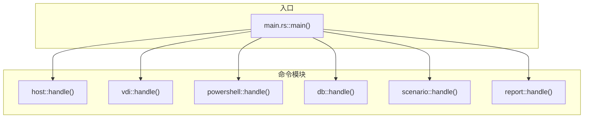
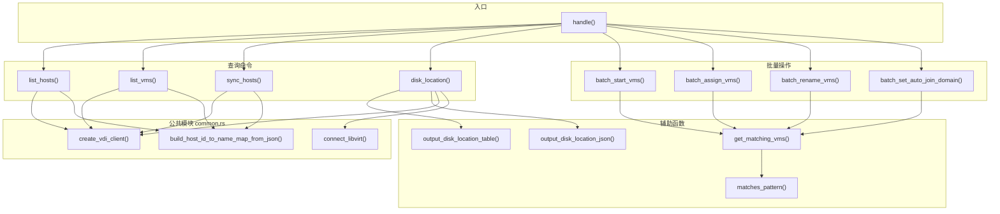
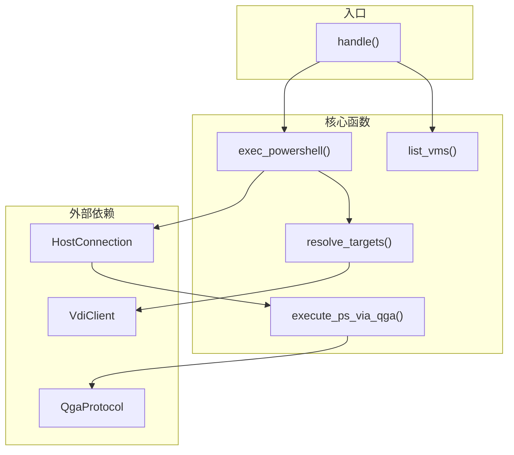
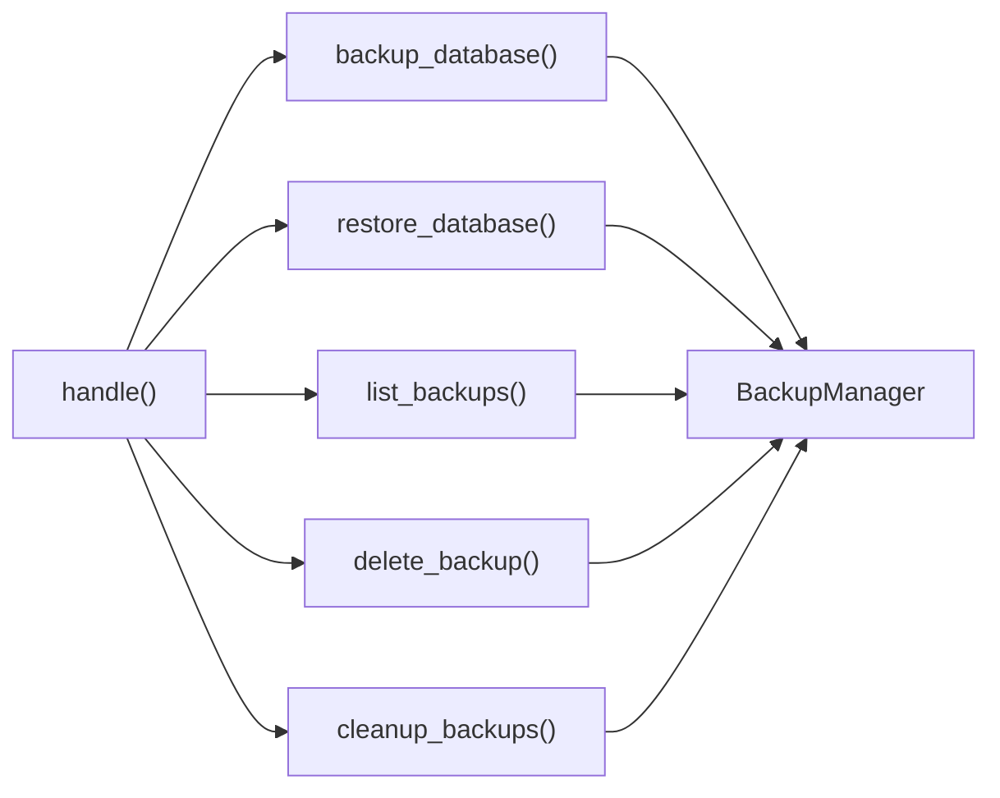
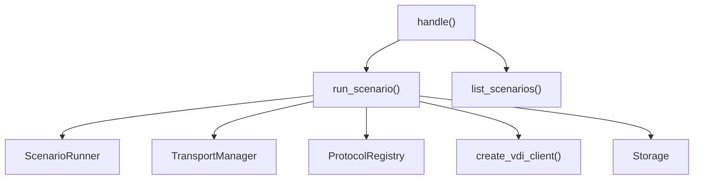
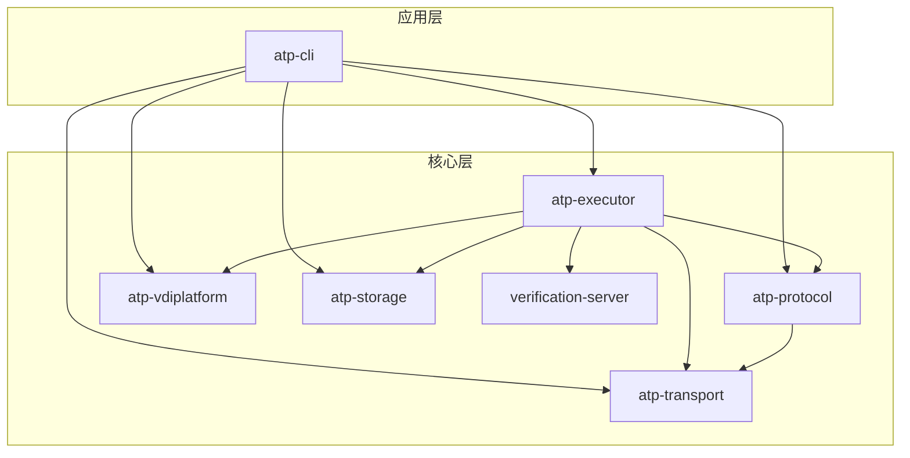

# OCloudView-ATP 代码架构分析文档

**生成日期**: 2026-01-05

---

## 1. 项目结构概览

```
ocloudview-atp/
├── atp-application/          # 应用层
│   ├── cli/                  # CLI 主程序 (atp 命令)
│   ├── http-api/             # HTTP API (TODO)
│   └── scenarios/            # 场景库 (空)
├── atp-core/                 # 核心模块
│   ├── executor/             # 场景执行器
│   ├── protocol/             # 协议层 (QMP/QGA/SPICE/VirtIO)
│   ├── transport/            # 传输层 (Libvirt 连接)
│   ├── vdiplatform/          # VDI 平台 API
│   ├── storage/              # SQLite 存储
│   ├── verification-server/  # 验证服务器
│   ├── ssh-executor/         # SSH 执行器
│   └── gluster/              # Gluster 存储
├── atp-common/               # 共享类型
├── guest-verifier/           # Guest 验证代理
│   ├── verifier-agent/
│   └── verifier-core/
└── docs/                     # 文档
```

---

## 2. CLI 入口调用链



---

## 3. VDI 模块函数调用关系

### 3.1 调用图



### 3.2 函数列表

| 函数 | 行号 | 功能 |
|------|------|------|
| `handle()` | 47-120 | 命令分发 |
| `verify_consistency()` | 123-324 | VDI-libvirt 一致性验证 |
| `list_hosts()` | 393-426 | 列出 VDI 主机 |
| `list_vms()` | 428-477 | 列出 VDI 虚拟机 |
| `sync_hosts()` | 479-522 | 同步主机到本地 |
| `disk_location()` | 524-673 | 磁盘存储位置查询 |
| `output_disk_location_table()` | 675-735 | 表格输出 |
| `output_disk_location_json()` | 739-801 | JSON 输出 |
| `matches_pattern()` | 807-842 | 模式匹配 |
| `get_matching_vms()` | 844-891 | 获取匹配虚拟机 |
| `batch_start_vms()` | 893-985 | 批量启动 |
| `batch_assign_vms()` | 987-1139 | 批量分配 |
| `batch_rename_vms()` | 1141-1252 | 批量重命名 |
| `batch_set_auto_join_domain()` | 1254-1363 | 批量设置自动加域 |

---

## 4. PowerShell 模块调用关系



| 函数 | 功能 |
|------|------|
| `exec_powershell()` | 执行 PowerShell 命令 |
| `execute_ps_via_qga()` | 通过 QGA 执行 |
| `resolve_targets()` | 解析目标虚拟机 |
| `list_vms()` | 列出可用虚拟机 |

---

## 5. DB 模块调用关系



---

## 6. Scenario 模块调用关系



---

## 7. 核心模块依赖



---

## 8. Common 模块公共函数

| 函数 | 功能 | 调用者 |
|------|------|--------|
| `create_vdi_client()` | 创建并登录 VDI | vdi, powershell, scenario |
| `build_host_id_to_name_map_from_json()` | 构建主机 ID 映射 | vdi, powershell |
| `connect_libvirt()` | 连接 libvirt | vdi |
| `LibvirtConnectionResult` | 连接结果结构体 | vdi |
